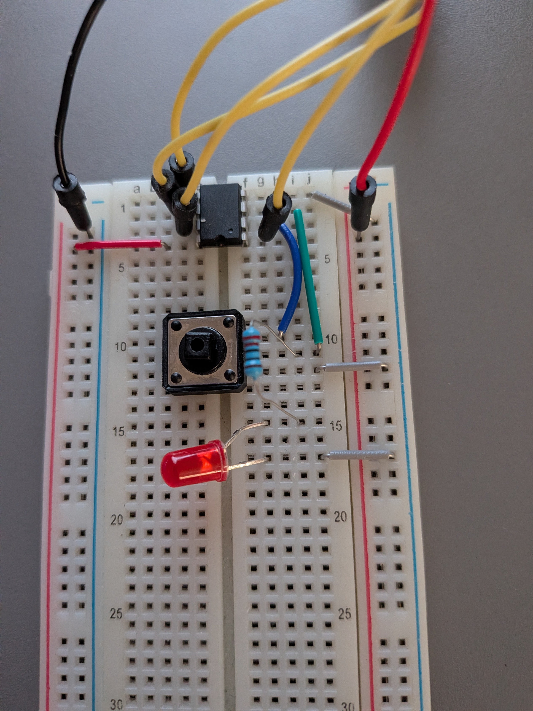

# ATtiny85 Button Blink

Second bare-metal ATtiny85 project — LED controlled by a button, in pure C using avr-gcc and USBasp, no Arduino IDE.

## Hardware

- **MCU**: ATtiny85 (DIP-8)
- **Programmer**: USBasp (10-pin IDC)
- **Connection**: breadboard + 6 jumper wires + button + 220 Ω resistor + LED

## Scheme




## Dependencies

- [avr-gcc 15.x](https://github.com/ZakKemble/avr-gcc-build/releases)
- [avrdude 8.x](https://github.com/avrdudes/avrdude/releases)
- USBasp driver — install via [Zadig](https://zadig.akeo.ie/) (select WinUSB)

## Project structure

```
.
├── button.c      # source
├── flash.ps1     # build & flash script
└── README.md
```

## Build & flash

```powershell
.\flash.ps1 button.c
```

Or manually:

Compile:
```powershell
avr-gcc -mmcu=attiny85 -DF_CPU=1000000UL -Os -o button.elf button.c
```

Convert to HEX:
```powershell
avr-objcopy -O ihex button.elf button.hex
```

Flash via USBasp:
```powershell
avrdude -c usbasp -p t85 -v -U flash:w:button.hex:i
```

## USBasp → ATtiny85 wiring

IDC connector orientation: notch faces toward the ribbon cable side, pin 1 is top-left.
ATtiny85 orientation: notch faces up, pin 1 is top-left.

| IDC 10-pin | Signal | ATtiny85 physical pin |
|------------|--------|-----------------------|
| 1          | MOSI   | 5 (PB0)               |
| 2          | VCC    | 8                     |
| 5          | RST    | 1                     |
| 7          | SCK    | 7 (PB2)               |
| 9          | MISO   | 6 (PB1)               |
| 10         | GND    | 4                     |

Pins 3, 4, 6, 8 of IDC are not connected.

## Button + LED circuit

```
ATtiny85 pin 2 (PB3) → button → pin 4 (GND)
ATtiny85 pin 3 (PB4) → 220 Ω resistor → LED+ → LED- → pin 4 (GND)
```

Internal pull-up on PB3 is enabled in software — no external resistor needed for the button.

## How it works

ATtiny85 reads PB3 state in a loop. When button is pressed, PB3 is pulled to GND and reads 0 — LED turns on. When released, internal pull-up pulls PB3 to VCC and reads 1 — LED turns off.

## Programmable GPIO pins

| Physical pin | Port | Role in this project |
|--------------|------|----------------------|
| 2            | PB3  | button input (pull-up enabled) |
| 3            | PB4  | LED output           |