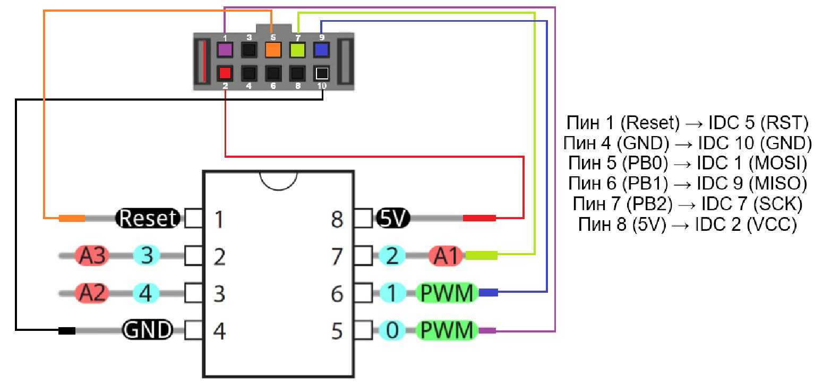
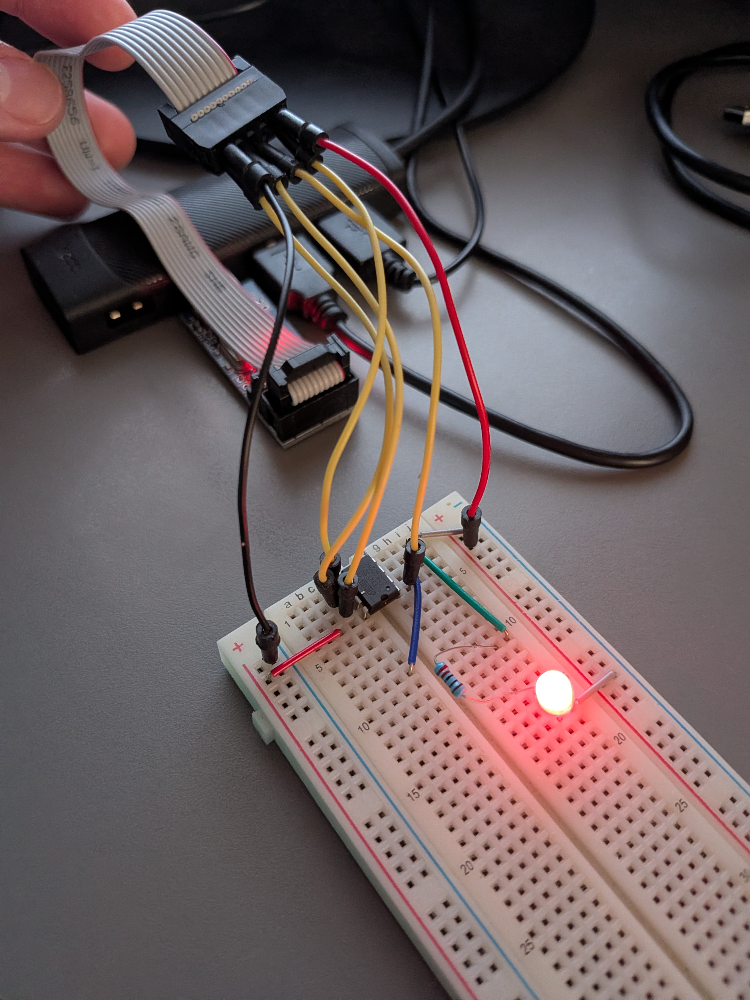

# ATtiny85 Blink

First bare-metal ATtiny85 project — LED blink in pure C using avr-gcc and USBasp, no Arduino IDE.

## Hardware

- **MCU**: ATtiny85 (DIP-8)
- **Programmer**: USBasp (10-pin IDC)
- **Connection**: breadboard + 6 jumper wires

## Scheme




## Dependencies

- [avr-gcc 15.x](https://github.com/ZakKemble/avr-gcc-build/releases)
- [avrdude 8.x](https://github.com/avrdudes/avrdude/releases)
- USBasp driver — install via [Zadig](https://zadig.akeo.ie/) (select WinUSB)

## Project structure

```
.
├── blink.c       # source
└── README.md
```

## Build & flash

Compile:
```powershell
avr-gcc -mmcu=attiny85 -DF_CPU=1000000UL -Os -o blink.elf blink.c
```

Convert to HEX:
```powershell
avr-objcopy -O ihex blink.elf blink.hex
```

Flash via USBasp:
```powershell
avrdude -c usbasp -p t85 -U flash:w:blink.hex:i
```

Verify chip is detected:
```powershell
avrdude -c usbasp -p t85 -v
```

## USBasp → ATtiny85 wiring

| IDC pin | Signal | ATtiny85 pin |
|---------|--------|--------------|
| 1       | MOSI   | 5            |
| 2       | VCC    | 8            |
| 5       | RST    | 1            |
| 7       | SCK    | 7            |
| 9       | MISO   | 6            |
| 10      | GND    | 4            |

## LED circuit

```
ATtiny85 pin 5 (PB0) → 220 Ω resistor → LED+ → LED- → pin 4 (GND)
```